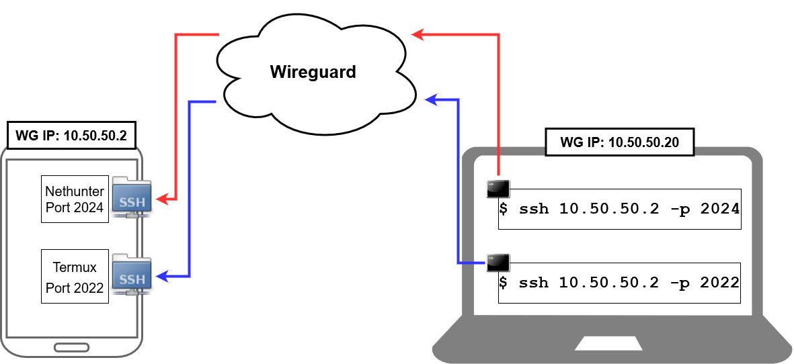

# <!--fit--> Pen-Testing with Mobile Devices

#### \*Ideas on building a red-team device in a mobile form-factor\*  

-------------------------------------------------

### Spencer Heywood

Blog: __https://the-empire.systems__

Github: __https://github.com/heywoodlh/__

-------------------------------------------------
# Form Factor

### Use a Phone! 
- Inexpensive
- Battery-powered
- Portable
- Optional: supplement capabilities with a Raspberry Pi Zero or 4.

Supports LineageOS & Kali NetHunter.

_iOS' security and environment restrictions make it a poor platform for this type of workflow_

-------------------------------------------------
# Recommendations

Don't be intimidated by these recommendations -- they're fairly simple to learn.

### Basic understanding of Android:
- `adb`/`fastboot`
- bootstrap applications
- Android permissions

### Hardware:
- \*LineageOS supported device: https://wiki.lineageos.org/devices/
- Kali NetHunter supported device: https://www.kali.org/get-kali/#kali-mobile
- Rootable

_* Check the LineageOS wiki if your desired device is still receiving OS updates_

-------------------------------------------------

# <!--fit--> A good suggestion: DON'T ROOT OR INSTALL NETHUNTER ON YOUR DAILY DRIVER

Rooting an Android device drastically reduces its security and pen-testing tools are meant to be weaponized. Keep your data safe and don't do this on your primary phone or on a device that you store sensitive information on.

Buy a separate device for this workflow. I like [Swappa](https://swappa.com) & [eBay](https://www.ebay.com) for buying used Android devices. 

Kali NetHunter has a rootless version, but rooting makes the device much more capable. I recommend that if you dedicate a phone to something like this that you just root it.

-------------------------------------------------
# Window Shopping (as of October 18, 2021)

Just to give you some ideas on how inexpensive this whole setup is.

Used prices @ [Swappa](https://swappa.com):

- Used OnePlus 3 (starts at $70):


- Used Nexus 5X (starts at $60):


-------------------------------------------------
# My Build Specs

OnePlus One (codename `bacon`):
- 64 GB internal storage
- 3 GB RAM
- [Qualcomm Snapdragon 801](https://www.qualcomm.com/products/snapdragon-processors-801)
- Bought for $50 @ [Swappa](https://swappa.com)  

Operating System/Tweaks:
- [LineageOS](https://lineageos.org) (I used LineageOS' recovery as well)
- Flashed NetHunter on top of LineageOS
- Flashed [Magisk](https://magisk.me/) to manage root access

-------------------------------------------------
# Process for Flashing

This process may vary based on your device, but should be around the same -- refer to the documentation for LineageOS, NetHunter and Magisk for device-specific instruction.

Flashing LineageOS is relatively simple using a computer with `adb` and `fastboot` installed:
1. Enable Android Debugging on your device
2. Boot into bootloader: `adb reboot bootloader`
3. Unlock bootloader: `fastboot oem unlock`
4. After device boots back up, go back to bootloader: `adb reboot bootloader`
5. Flash Lineage recovery: `fastboot flash recovery <recovery_filename>.img`
6. Boot into recovery (normally by pressing a certain button combination on the phone while booting)
7. In Lineage Recovery, go to Apply Update > Apply from ADB and then run the following command to sideload LineageOS' image: `adb sideload <image>.zip`

To flash NetHunter and Magisk:
1. Boot into recovery
2. In Lineage Recovery, go to Apply Update > Apply from ADB and then run the following command for the NetHunter image and then the Magisk image: `adb sideload <image>.zip`

-------------------------------------------------
# Essential Apps

## App stores:

- [F-Droid](https://f-droid.org/): Open source app store for open source apps. Available for any Android.
- [Kali Nethunter App Store](https://store.nethunter.com/): Fork of F-Droid with repositories containing Android security applications available for use with Nethunter. You do not need to flash Kali Nethunter on the device to use the app store.


## Security apps:

- [Nethunter](https://store.nethunter.com/en/packages/com.offsec.nethunter/): Provides a full emulated Kali environment running on the Android device
- [cSploit](https://store.nethunter.com/en/packages/org.csploit.android/): Suite of pen-testing tools to easily attack an environment
- [Rucky](https://store.nethunter.com/en/packages/com.mayank.rucky/): USB Rubber Ducky capabilities for your Android device
- [Termux](https://f-droid.org/en/packages/com.termux/): Terminal emulator, runs a custom Linux environment
- [Termux:Boot](https://f-droid.org/en/packages/com.termux.boot/): Runs Termux scripts automatically on boot
- [Termux:API](https://f-droid.org/en/packages/com.termux.api/): Provides Termux additional access to view or configure additional Android hardware (location, sensors, etc.)
- [DriveDroid](https://store.nethunter.com/en/packages/com.softwarebakery.drivedroid/): 

## Other apps:

- [Wireguard](https://f-droid.org/en/packages/com.wireguard.android/): open source VPN application/protocol -- very resilient to disconnects
- [Hacker's Keyboard](https://f-droid.org/en/packages/org.pocketworkstation.pckeyboard/): keyboard app that provides a full QWERTY keyboard when phone is in landscape

-------------------------------------------------
# Remote Access

I have a Wireguard server setup which allows me to securely tunnel encrypted traffic between the OnePlus One and other devices that need to access it remotely. The Android has been configured to have the Wireguard tunnel to be always-on.

Termux has been configured with OpenSSH server running on port 2022.

NetHunter has OpenSSH server running on port 2024.



-------------------------------------------------
# What Can You Do?

Here are some things I've done:
- Run a full, emulated Kali environment on Android hardware with NetHunter
- Ducky Scripts
- Run a custom Linux environment that can take advantage of Android's sensors

Let's go over some specific workflows.

-------------------------------------------------
# Vulnerability Scanning

Vulnerability scanners are usually bulky applications that are pretty resource intensive.

So I went searching for lightweight vulnerability scanners and here is something I found:

[Introducing Flan Scan: Cloudflare’s Lightweight Network Vulnerability Scanner](https://blog.cloudflare.com/introducing-flan-scan/)

Upon digging into Flan Scan by Cloudflare I learned that Flan Scan basically provides graphical reports from the results of `nmap`'s vulners script.

You can invoke this script like so:

```
nmap -sV --script=vulners.nse ...
```

So now we have a simple but effective method of doing a vulnerability scan from our Android device.

-------------------------------------------------
# Vulnerability Scan and Exploit from an Android


-------------------------------------------------
